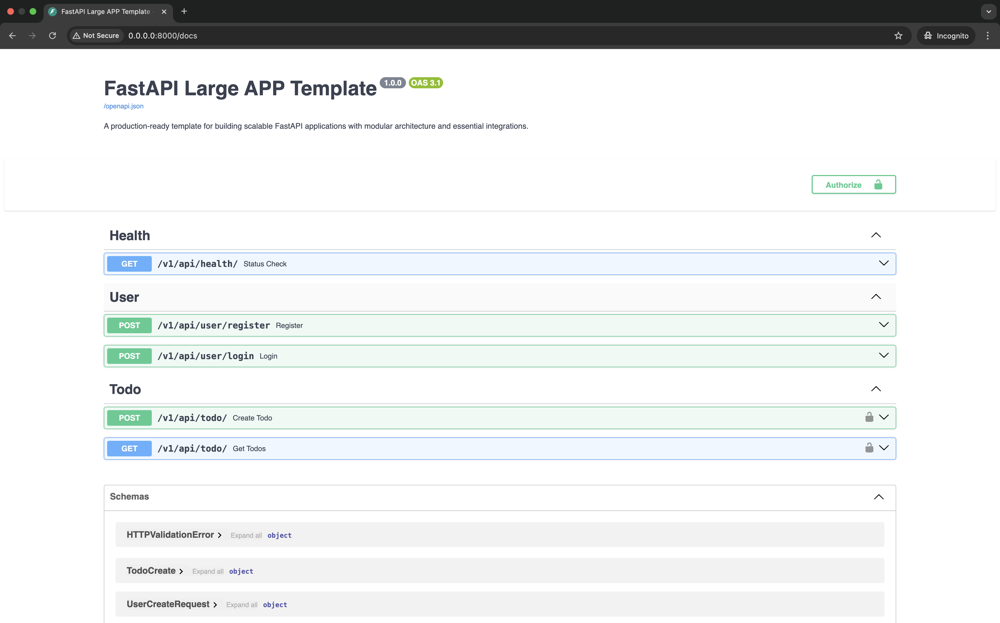

# FastAPI Large Application Template 🚀

[](https://fastapi.tiangolo.com)
[](https://www.postgresql.org/)
[](https://redis.io/)

A production-ready template for building scalable FastAPI applications with modular architecture and essential integrations.

## Features ✨

- **JWT Authentication** with refresh tokens 🔒
- **Custom Rate Limiting** per user/service ⏱️
- **Unified Logging** (UVICORN + GUNICORN) 📝
- **Redis Connection Pooling** with fail-open strategy 🧠
- **PostgreSQL Connection Pooling** with health checks 🐘
- **Standardized API Responses** 📦
- **Production-Ready Error Handling** 🛡️
- **Docker** + **Gunicorn** + **Uvicorn** Stack 🐳⚡

## Tech Stack 🛠️

| Component              | Technology                          |
|------------------------|-------------------------------------|
| Framework              | FastAPI 0.111+                      |
| Database               | PostgreSQL 14+                      |
| Cache                  | Redis 6+                            |
| ORM                    | SQLAlchemy 2.0                      |
| Authentication         | JWT (OAuth2 Password Bearer)        |
| Rate Limiting          | Redis-backed Custom Implementation  |
| Containerization       | Docker + Docker Compose             |

## Project Structure 🌳

<!-- TREE_START -->
```
.
├── app
│   ├── health
│   │   └── health_router.py
│   ├── todo
│   │   ├── todo_crud.py
│   │   ├── todo_model.py
│   │   ├── todo_router.py
│   │   ├── todo_schema.py
│   │   └── todo_service.py
│   ├── user
│   │   ├── user_auth.py
│   │   ├── user_crud.py
│   │   ├── user_model.py
│   │   ├── user_router.py
│   │   ├── user_schema.py
│   │   └── user_service.py
│   ├── utils
│   │   ├── auth_dependency.py
│   │   ├── helper.py
│   │   └── rate_limiter.py
│   ├── database.py
│   └── settings.py
├── docs
│   └── swagger-screenshot.png
├── CONTRIBUTORS.txt
├── Dockerfile
├── LICENSE
├── README.md
├── gunicorn_conf.py
├── main.py
├── requirements.txt
├── run.sh
├── set_env.sh
└── tree.txt

7 directories, 28 files
```
<!-- TREE_END -->
---

## Key Implementations 🔑

### Database Pooling Configuration

**PostgreSQL (SQLAlchemy + psycopg2):**
```python
engine = create_engine(
    SQLALCHEMY_DATABASE_URL,
    pool_size=20,          # Maximum 20 persistent connections
    max_overflow=10,       # Allow 10 temporary overflow connections
    pool_recycle=300,      # Recycle connections after 5 minutes
    pool_pre_ping=True     # Validate connections before use
)
```
- **Pool Size:** Optimized for moderate concurrency
- **Connection Recycling:** Prevents stale connections
- **Pre-ping:** Ensures connection validity

**Redis Connection Pool:**
```python
redis = await Redis(
    host="redis.prod.internal",
    port=6379,
    db=0,
    password="securepassword",
    socket_connect_timeout=5,    # 5s connection timeout
    socket_keepalive=True,       # Maintain TCP keepalive
    retry_on_timeout=True,       # Auto-retry failed operations
    max_connections=100,         # Max pool size
    health_check_interval=30     # Validate connections every 30s
)
```
- **Enterprise Features:** TLS support, cluster mode ready
- **Resiliency:** Automatic retries and health checks

---

### 🔒 Secure Endpoint Example

**Protected Todo Creation:**
```python
@router.post("/")
async def create_todo(
    body: TodoCreate,
    current_user: User = Depends(get_current_user),
    db: Session = Depends(get_db)
):
    """
    Implements:
    - JWT Authentication
    - User-based Rate Limiting
    - Structured Error Handling
    - Audit Logging
    """
    try:
        # Rate limit check
        await user_rate_limiter(current_user.user_id, "todo_write")
        
        # Business logic
        data = create_todo_service(current_user.user_id, body, db)
        
        # Standardized success response
        return {
            "status": "success",
            "message": "Todo created",
            "data": data
        }
        
    except HTTPException as e:
        # Preserve existing HTTP exceptions
        raise
    except Exception as e:
        # Log full error context
        logger.error(f"Todo creation failed: {str(e)}", exc_info=True)
        # Return standardized error format
        raise HTTPException(
            status_code=status.HTTP_500_INTERNAL_SERVER_ERROR,
            detail="Internal server error"
        )
```

---

### ⏱️ Custom Rate Limiting

**Implementation:**
```python
async def user_rate_limiter(
    user_id: str,
    service: str,
    times: int = 5,
    seconds: int = 60
):
    """
    Redis-backed rate limiter using LUA scripts for atomic operations
    """
    key = f"rl:user:{user_id}:{service}"
    try:
        pexpire = await FastAPILimiter.redis.evalsha(
            FastAPILimiter.lua_sha, 1, 
            key, 
            str(times), 
            str(seconds * 1000)  # Convert to milliseconds
        )
        if pexpire != 0:
            raise HTTPException(
                status_code=429,
                detail=f"Try again in {ceil(pexpire/1000)} seconds"
            )
    except Exception as e:
        logger.error(f"Rate limit check failed: {str(e)}")
        # Fail-open during Redis outages
```

**Features:**  
✅ User+service specific limits  
✅ Atomic Redis operations via LUA scripts  
✅ Fail-open circuit breaker pattern  
✅ Millisecond precision timeouts  
✅ Automatic retry-after calculation  

---

### 📝 Unified Logging System

**Configuration:**
```python
logging_config = {
    "version": 1,
    "formatters": {
        "standard": {
            "format": "[{asctime}] [{process}] [{levelname}] {module}.{funcName}:{lineno} - {message}",
            "datefmt": "%Y-%m-%d %H:%M:%S %z",
            "style": "{"
        }
    },
    "handlers": {
        "console": {
            "class": "logging.StreamHandler",
            "formatter": "standard",
            "stream": "ext://sys.stdout"
        }
    },
    "loggers": {
        "": {"level": "DEBUG", "handlers": ["console"], "propagate": False},
        "uvicorn": {"level": "INFO", "propagate": False},
        "uvicorn.access": {"level": "INFO", "propagate": False},
        "uvicorn.error": {"level": "INFO", "propagate": False}
    }
}
```

**Log Example:**  
```
[2024-05-20 14:30:45 +0000] [1234] [INFO] todo.routers.create_todo:52 - Created todo ID:42
```

**Features:**  
📌 Consistent timestamp with timezone  
📌 Process ID tracking  
📌 Module/function/line number context  
📌 Uvicorn log unification  
📌 Production-ready INFO level defaults  

---

### 📦 Standardized API Response

**Success Response:**
```json
{
  "status": "success",
  "message": "Todo created successfully",
  "data": {
    "id": 42,
    "task": "Implement rate limiting"
  }
}
```

**Error Response:**
```json
{
  "status": "error",
  "message": "Validation Failed",
  "errors": [
    {
      "field": "task",
      "message": "Field required"
    }
  ]
}
```

**Implementation:**
```python
@app.exception_handler(RequestValidationError)
async def validation_handler(request: Request, exc: RequestValidationError):
    return JSONResponse(
        status_code=422,
        content={
            "status": "error",
            "code": 422,
            "message": "Validation Failed",
            "errors": exc.errors()
        }
    )

@app.exception_handler(HTTPException)
async def http_handler(request: Request, exc: HTTPException):
    return JSONResponse(
        status_code=exc.status_code,
        content={
            "status": "error",
            "code": exc.status_code,
            "message": exc.detail,
            "errors": getattr(exc, "errors", None)
        }
    )
```

**Features:**  
✅ RFC-compliant error formats  
✅ Automatic validation error parsing  
✅ Consistent error code mapping  
✅ Detailed error context preservation  


## Getting Started

### Prerequisites

- Python 3.9+
- PostgreSQL 14+
- Redis 6+
- Docker (optional)

### Installation

```bash
git clone https://github.com/yourrepo/fastapi-template.git
cd fastapi-template
python -m venv venv
source venv/bin/activate
pip install -r requirements.txt
```

### Configuration

1. Create `.env` from template:
```bash
cp .env.example .env
```

2. Set environment variables:
```bash
source set_env.sh  # Sets DB, Redis, and JWT settings
```

### Running

**Development:**
```bash
python main.py
```

**Production:**
```bash
./run.sh  # Starts Gunicorn with Uvicorn workers
```

## API Documentation 📚

Access interactive docs after starting server:
- **Swagger UI:** `http://localhost:8000/docs`
- **ReDoc:** `http://localhost:8000/redoc`



## Contributing

See [CONTRIBUTORS.txt](CONTRIBUTORS.txt) for contribution guidelines and code of conduct.

## License

This project is licensed under the MIT License - see [LICENSE](LICENSE) for details.
