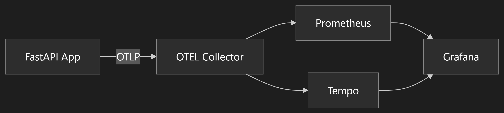
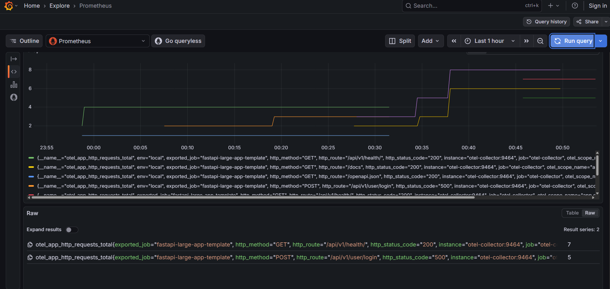
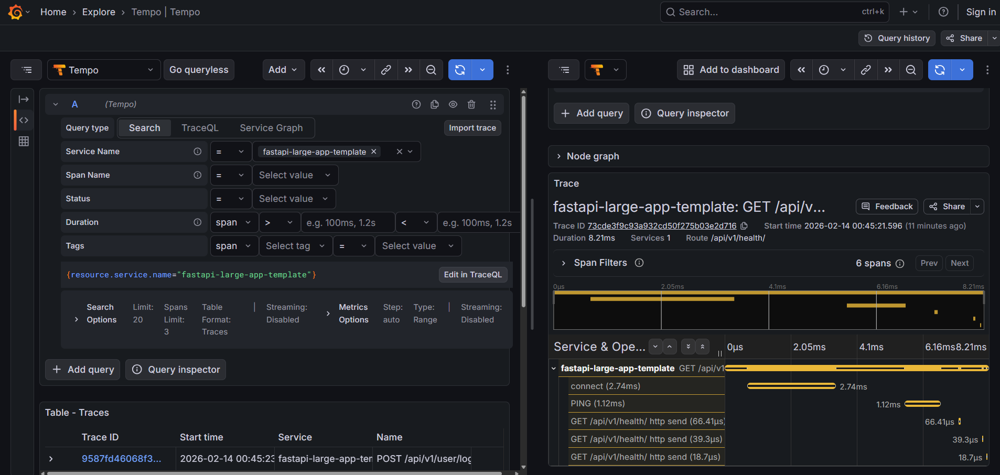

# Observability Guide 📊

This document describes the production-grade observability stack included in this FastAPI template. It covers metrics, distributed tracing, dashboards, and the design decisions behind the implementation.

> This observability setup is intentionally **minimal, opinionated, and production-first**. It favors correctness and low operational overhead over metric volume.

---

## Overview

Observability in this template is built on **OpenTelemetry (OTEL)** — an open-source standard for collecting telemetry data (traces, metrics, logs). The goal is production-ready visibility into application behavior without bloating code or introducing fragile custom instrumentation.

### Design Goals

1. **OTEL-first** — All telemetry flows through OpenTelemetry SDKs and exporters
2. **No duplicate HTTP metrics** — We rely on auto-instrumentation for HTTP server metrics rather than adding custom middleware for the same data
3. **Production-safe** — Telemetry is non-blocking; auto-instrumentation and custom metrics never crash requests
4. **Golden Signals** — Focus on the four key signals: latency, traffic, errors, saturation

---

## Architecture



### Why This Design?

- **OTEL Collector** acts as a buffer and batcher, reducing pressure on the application
- **Prometheus** pulls metrics from the Collector (scrape model)
- **Tempo** receives traces push-style via OTLP
- **Grafana** provides a unified UI for both metrics and traces

---

## What You Get Out of the Box

### Golden Signals

| Signal | Metric(s) | What It Tells You |
|--------|-----------|-------------------|
| **Latency** | `otel_http_server_duration_milliseconds` (histogram) | How slow are requests? P50/P95/P99 |
| **Traffic** | `otel_http_server_duration_milliseconds_count` (counter) | How much throughput? RPS |
| **Errors** | `otel_http_server_duration_milliseconds` filtered by `http_status_code=~"5.."` | Are requests failing? |
| **Saturation** | `otel_http_server_active_requests` | How busy is the system? |

### Rate Limiter Visibility

The rate limiter is a critical component. We expose:

- `otel_app_ratelimiter_allowed_total` — requests allowed
- `otel_app_ratelimiter_rejected_total` — requests rejected (429)
- `otel_app_ratelimiter_degraded_total` — fail-open events (Redis down)

### Instrumentation Failure Detection

If auto-instrumentation fails (e.g., SQLAlchemy connection issues), we track it:

- `otel_app_instrumentation_failures_total{component="sqlalchemy"}`

This helps debug observability pipeline issues separately from application issues.

### Trace ↔ Metric Correlation

Grafana's **Trace to Metrics** feature lets you click a slow trace and jump to related latency metrics. This is pre-configured in the Tempo datasource.

---

## Metrics Inventory

### Auto-Instrumented Metrics (OpenTelemetry)

These come from `FastAPIInstrumentor` and require no code changes:

| Metric | Type | Labels | Description |
|--------|------|--------|-------------|
| `otel_http_server_duration_milliseconds_*` | Histogram | `http_target`, `http_method`, `http_status_code` | Request latency histogram |
| `otel_http_server_active_requests` | UpDownCounter | `http_target`, `http_method` | In-flight requests |
| `otel_http_server_request_size_bytes` | Histogram | `http_target` | Request body size |
| `otel_http_server_response_size_bytes` | Histogram | `http_target` | Response body size |

> **Note:** We use `http_target` (the request path like `/api/v1/user/login`). While not normalized to route templates in Python metrics yet, our API routes are stable and low-cardinality, making `http_target` safe for production dashboards.

### Custom Application Metrics

Defined in [`app/observability/metrics.py`](../app/observability/metrics.py):

| Metric | Type | Labels | Description |
|--------|------|--------|-------------|
| `app.db.query_duration_ms` | Histogram | `db_statement_name`, `db_operation` | Database query latency |
| `app.db.query_count` | Counter | `db_statement_name`, `db_operation` | Total queries executed |
| `app.redis.commands_total` | Counter | `redis_command` | Redis commands executed |
| `app.redis.command_duration_ms` | Histogram | `redis_command` | Redis command latency |
| `app.ratelimiter.allowed_total` | Counter | `ratelimit_service` | Rate-limited requests allowed |
| `app.ratelimiter.rejected_total` | Counter | `ratelimit_service` | Rate-limited requests rejected |
| `app.ratelimiter.degraded_total` | Counter | `ratelimit_service` | Rate limiter fail-open events |
| `app.instrumentation.failures_total` | Counter | `component` | Instrumentation failures |
| `app.todos.created_total` | Counter | — | Total todos created |
| `app.users.registered_total` | Counter | — | Total users registered |

### What Was NOT Implemented (Intentionally)

- **Custom HTTP request counters** — The `otel_http_server_*` metrics from auto-instrumentation already provide this. Adding custom counters would duplicate data.
- **Request/response body logging in traces** — Off by default to avoid sensitive data exposure. Enable per-endpoint if needed.
- **Loki for logs** — Logs are exported via the orchestration layer (e.g., Kubernetes DaemonSet, Docker logging driver). The application writes structured logs to stdout, and the underlying platform handles collection and forwarding to log aggregation services.

---

## Golden Signals Dashboard

The dashboard includes these panels:

### Summary Row (Top)
- **Request Rate (RPS)** — Overall requests per second
- **Error Rate (5xx %)** — 5xx errors as percentage of total
- **P95 Latency (ms)** — 95th percentile latency
- **In-flight Requests** — Current active requests

### Latency
- **HTTP Latency — P50 / P95 / P99** — Time series showing latency percentiles
- **Top 10 Slowest Endpoints (P95)** — Which routes are slowest?

### Traffic
- **Requests by Endpoint (RPS)** — Per-endpoint throughput
- **Avg Request / Response Size** — Payload sizes

### Rate Limiter
- **Rate Limiter — Allowed (by service)** — Traffic allowed per service

### Errors & Instrumentation
- **Instrumentation Failures (5m rate)** — Is observability itself broken?
- **Recent Errors (5xx) — By Endpoint** — Where are errors happening?

---

## How to Import the Dashboard

1. Start the observability stack:
   ```bash
   cd docker/observability
   docker compose up -d
   ```

2. Open Grafana at http://localhost:3000 (admin/admin)

3. Go to **Dashboards → Import**

4. Upload the dashboard JSON file: `docs/grafana-dashboard.json`

5. Select **Prometheus** as the datasource

6. Click **Import**

The dashboard will appear in your Grafana instance and start visualizing metrics immediately (assuming the app is running and sending data).

---

## Screenshots

### Golden Signals Dashboard


### Prometheus Metrics Explore


### Tempo Traces View


---

## Key PromQL Examples

### Request Rate (RPS)
```promql
sum(rate(otel_http_server_duration_milliseconds_count[1m]))
```

### Error Rate (5xx)
```promql
(
  sum(rate(otel_http_server_duration_milliseconds_count{http_status_code=~"5.."}[5m]))
  /
  sum(rate(otel_http_server_duration_milliseconds_count[5m]))
) * 100
```

### P95 Latency
```promql
histogram_quantile(
  0.95,
  sum by (le) (rate(otel_http_server_duration_milliseconds_bucket[5m]))
)
```

### In-flight Requests
```promql
sum(otel_http_server_active_requests)
```

### Rate Limiter by Service
```promql
# Allowed
sum by (ratelimit_service) (rate(otel_app_ratelimiter_allowed_total[1m]))

# Rejected
sum by (ratelimit_service) (rate(otel_app_ratelimiter_rejected_total[1m]))
```

### Instrumentation Failures
```promql
sum(rate(otel_app_instrumentation_failures_total[5m]))
```

---

## Trace Usage (Tempo)

### Finding Slow Traces

1. In Grafana, go to **Explore**
2. Select **Tempo** datasource
3. Run a query like:
   ```
   {span.name="/api/v1/todo"} | duration > 1s
   ```
4. Click on a trace to see the full span waterfall

### Finding Error Traces

```
{span.name="/api/v1/user"} | status = error
```

### Trace-Driven Debugging

The workflow is:

1. **Alert fires** — "P95 latency > 500ms on /api/v1/todo"
2. **Check dashboard** — Confirm the latency spike
3. **Click trace link** — Jump to Tempo from the dashboard
4. **Find slow span** — Look for DB calls > 200ms in the waterfall
5. **Fix** — Add index, optimize query, cache result

---

## Validation Checklist

Run these queries in Grafana Explore to verify observability is working:

| Check | Query | Expected |
|-------|-------|----------|
| App is sending metrics | `up{exported_job=~".*fastapi.*"}` | `1` |
| HTTP requests appear | `otel_http_server_duration_milliseconds_count` | > 0 |
| Latency histogram exists | `histogram_quantile(0.95, sum by (le) (rate(otel_http_server_duration_milliseconds_bucket[5m])))` | A number, not `NaN` |
| Rate limiter visible | `rate(otel_app_ratelimiter_allowed_total[1m])` | > 0 (after making requests) |
| Traces available | Tempo service graph | Shows FastAPI node |

---

## Design Decisions & Trade-offs

### Why `http_target` Instead of `http_url`?

`http_target` represents the request path (e.g., `/api/v1/user/login`). While not normalized to route templates in Python metrics yet, our API routes are stable and low-cardinality, making `http_target` safe to use in dashboards today.

### Why Auto-Only HTTP Metrics?

OpenTelemetry's `FastAPIInstrumentor` provides comprehensive HTTP metrics out of the box. Adding custom middleware would:
- Duplicate data
- Increase maintenance burden
- Risk missing edge cases (e.g., exception handling)

We focus custom metrics on **application-level** concerns (DB, Redis, rate limiter) that auto-instrumentation doesn't cover.

### Why No Logs in OTEL?

Structured logging to stdout is still the standard for Kubernetes/logging backends. Adding OTEL log exporters adds complexity.

---

## Next Steps

### Alerts & SLOs

- Create Prometheus alert rules for latency/error thresholds
- Define SLOs (e.g., "P99 latency < 2s for 99.9% of requests")

### Loki Integration

Add Loki for log aggregation and correlation with traces:
```
{job="fastapi"} |= "todo"
```

### Kubernetes Deployment

- Deploy OTEL Collector as a DaemonSet or sidecar
- Use Prometheus Operator for CRD-based scraping
- Integrate with GKE/Grafana Cloud for managed Tempo

---

## References

- [OpenTelemetry Python SDK](https://opentelemetry.io/docs/instrumentation/python/)
- [PromQL Cheat Sheet](https://prometheus.io/docs/prometheus/latest/querying/basics/)
- [Grafana Tempo Docs](https://grafana.com/docs/tempo/latest/)
- [Golden Signals Monitoring](https://sre.google/sre-book/monitoring-distributed-systems/#golden-signals)
